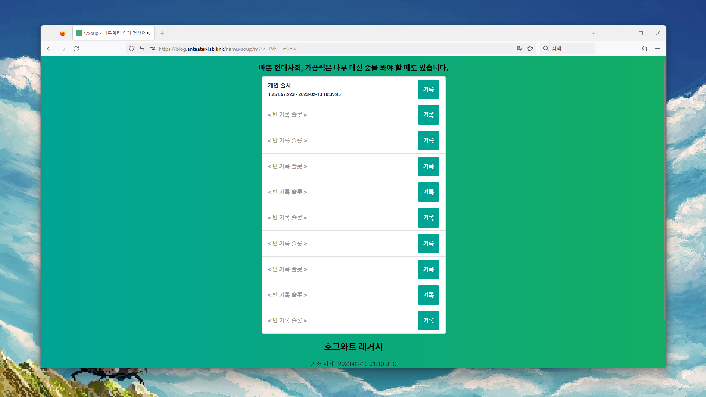
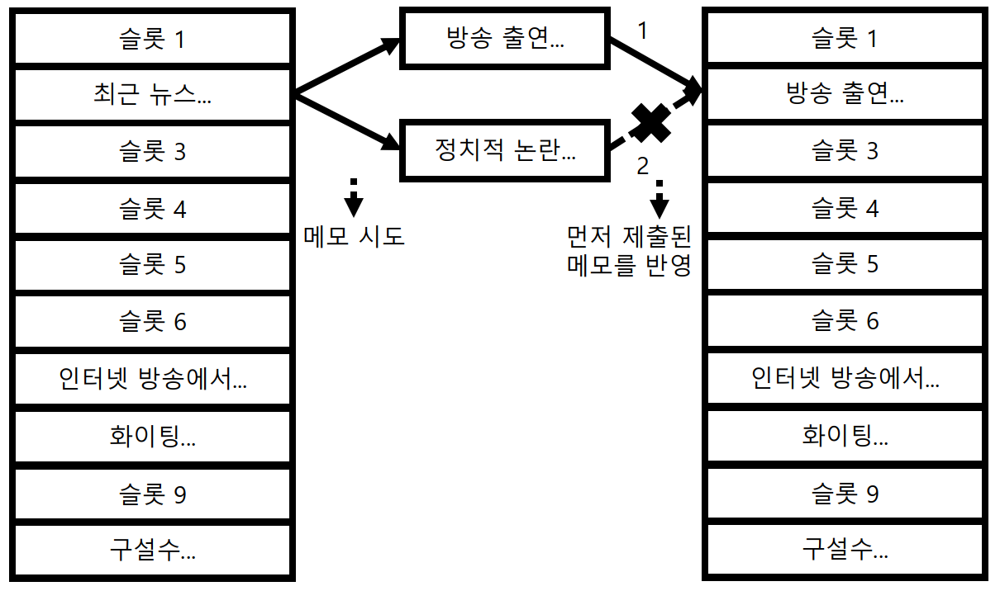

# 숲Soup - 나무위키 인기 검색어 크롤러

> ## "바쁜 현대사회, 가끔 나무 대신 숲을 봐야 할 때도 있습니다."

## 화면

## 소개

## 개발자의 변

2022년 3월 17일 갑작스럽게 아이디어가 생각나서 셀프 해커톤을 한 결과물 입니다. 사실 배포까지 완료하려 했는데, Selenium이 2GB 메모리를 권장사항으로 제시하는 데다가, 그걸 견딜만한 무료 외국 서버 인스턴스에서는 크롤러가 Cloudflare에 막혀버리는 문제가 생겨서... 좀 넉넉해지면 다시 배포 시도해볼게요... 크롤러는 Docker 이미지도 만들어놔서 그것만 컨테이너로 빌드해서 실행하면 됩니다.
